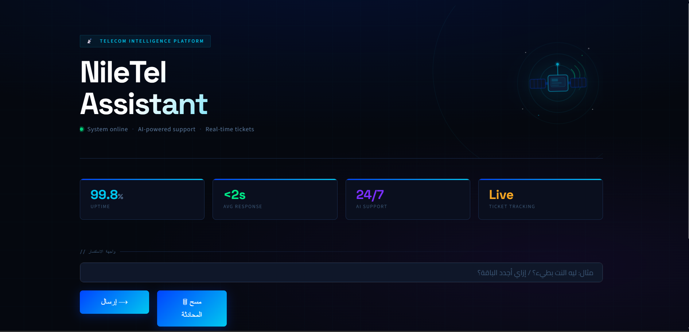

# 📡 NileTel AI Assistant

An Arabic-first AI-powered customer support assistant for NileTel Telecom, built with a RAG (Retrieval-Augmented Generation) pipeline, conversational memory, and automatic ticket escalation.

---

## ✨ Features

- 🧠 **RAG Pipeline** — Hybrid semantic + BM25 retrieval with RRF fusion for accurate answers
- 💬 **Conversational Memory** — Per-session sliding window memory (last 6 exchanges)
- 🎫 **Smart Ticket Creation** — Automatically extracts the original problem from history when user requests escalation
- 🌙 **RTL Dark UI** — Full Arabic/RTL support with a modern dark theme built in Streamlit
- 📊 **Live Ticket Management** — Real-time ticket tracking from Google Sheets
- ⚡ **Fast Responses** — FAISS index cached on first run (~2s load after first build)

---
## 🖥️ UI Preview
 

---
## 🛠️ Tech Stack

| Layer | Technology |
|---|---|
| Frontend | Streamlit |
| Backend | FastAPI + Uvicorn |
| LLM | Groq (llama-3.1-8b-instant) |
| Embeddings | intfloat/multilingual-e5-large |
| Vector Search | FAISS |
| Keyword Search | BM25 (rank-bm25) |
| Data | Markdown files (.md) |

---

## 📁 Project Structure

```
telecom-rag-assistant/
├── data/
│   └── data/              # Knowledge base (.md files)
├── cache/                 # FAISS index + chunks (auto-generated)
├── rag_core.py            # RAG pipeline + memory + ticket logic
├── mains2.py              # FastAPI backend
├── streams2.py            # Streaming support
├── app.py                 # Streamlit frontend
├── .env                   # API keys (not committed)
└── requirements.txt
```

---

## 🚀 Getting Started

### 1. Clone the repo
```bash
git clone https://github.com/Merna-Hany12/Telecom-RAG-Assistant.git
cd telecom-rag-assistant
```

### 2. Create a virtual environment
```bash
python -m venv .venv
.venv\Scripts\activate      # Windows
source .venv/bin/activate   # Mac/Linux
```

### 3. Install dependencies
```bash
pip install -r requirements.txt
```

### 4. Set up environment variables
Create a `.env` file in the root:
```env
GROQ_API_KEY=your_groq_api_key_here
```

### 5. Add your knowledge base
Put your `.md` files inside `data/data/`.

### 6. Run the backend
```bash
uvicorn mains2:app --reload
```

### 7. Run the frontend
```bash
streamlit run app.py
```

> ⚠️ First run will build the FAISS index (~50 seconds). After that it loads from cache in ~2 seconds.

---

## 🔄 How It Works

```
User Query
    │
    ▼
Route Query ──► Greeting / Out-of-scope / Ticket request / Chat
    │
    ▼ (Chat)
Hybrid Retrieval (FAISS + BM25 + RRF fusion)
    │
    ▼
LLM Generation (Groq) + Conversation History
    │
    ▼
Response + needs_action flag
    │
    ▼
Streamlit UI (RTL Arabic bubbles + ticket status bar)
```

---

## 🎫 Ticket Escalation Logic

When a user requests a ticket (e.g. "ارفع تذكرة" / "ابعت مهندس"), the system:

1. Walks conversation history **oldest-first**
2. Finds the first message containing a real telecom problem description
3. Attaches it to the ticket as "المشكلة المسجلة"

This ensures the ticket always contains the **original problem**, not a follow-up reply like "لا لسه بطيئة".

---

## 📦 Requirements

```
fastapi==0.99.1
uvicorn==0.39.0
sentence-transformers==5.1.2
faiss-cpu==1.13.0
numpy==2.0.2
groq==1.0.0
python-dotenv==1.2.1
rank-bm25==0.2.2
requests==2.32.5
streamlit==1.50.0
pandas==2.3.3
```

---

## 🔑 Environment Variables

| Variable | Description |
|---|---|
| `GROQ_API_KEY` | Your Groq API key from [console.groq.com](https://console.groq.com) |

---

## 📝 License

MIT License — feel free to use and modify.